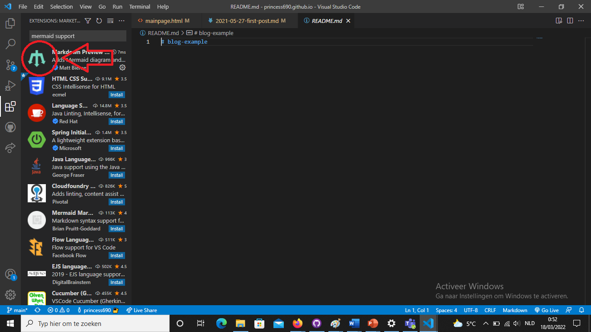
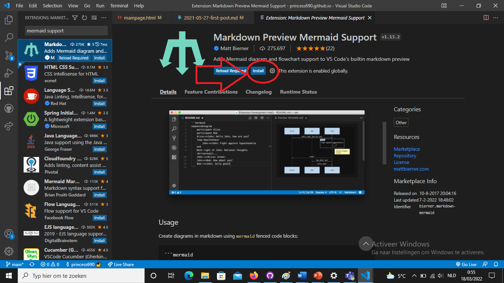
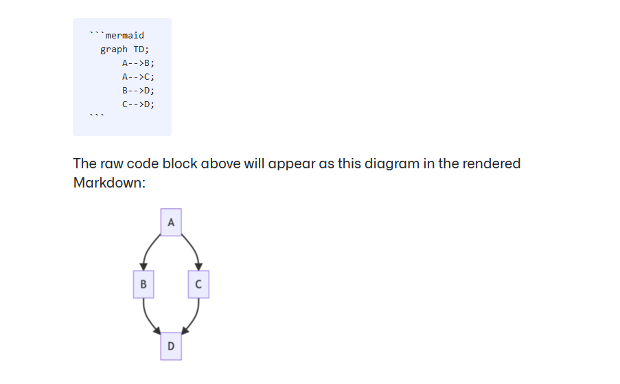
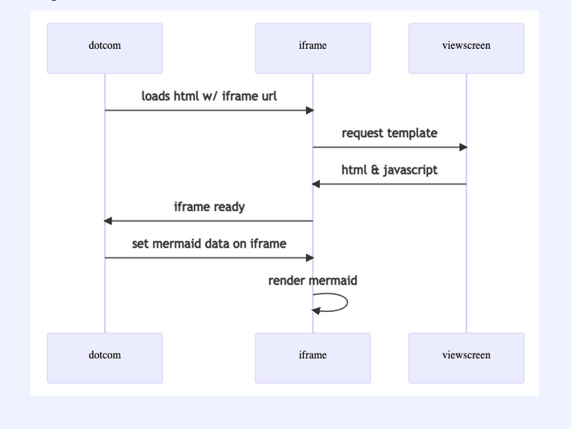

## uitleg

Mermaid support is een extension van Visual Studio Code. Het helpt je om diagrammen te maken van klassen en andere dingens die je in diagram vorm wil hebben op Visual Studio Code of Github.

<!--more-->

## hoe installeer je het

Om dit te downloaden ga je naar visual studio code en druk je op extensions.

Als je daar eenmaal op geklikt hebt druk je op de zoekbalk bovenaan en vul je in "mermaid support". Druk op de afbeelding met de omgekeerde drietand.

Als je daar eenmaal op heb geklikt druk je op "instal" en wacht je even het zou niet lang duren.

Nu het geinstaleerd is kan je er mee aan de slag gaan.

## hoe gebruik je het

Je gebruikt het voor diagrammen te maken. wanneer je een codeblok start met "mermaid" gaat het automatisch een frame genereren die het dan brengt naar jou mermaid.js en als je dan gaat kijken in je bestand in de live server zal het er uit zien als een diagram. let op voor de pijltjes als je het niet zeker weet zoek het dan op.

Deze extension kan je helpen met het visualizeren van een game die je opstelt met klassen. hier nog een afbeelding in diagram vorm van het pad die je code aflegt als je een diagram wil maken:

