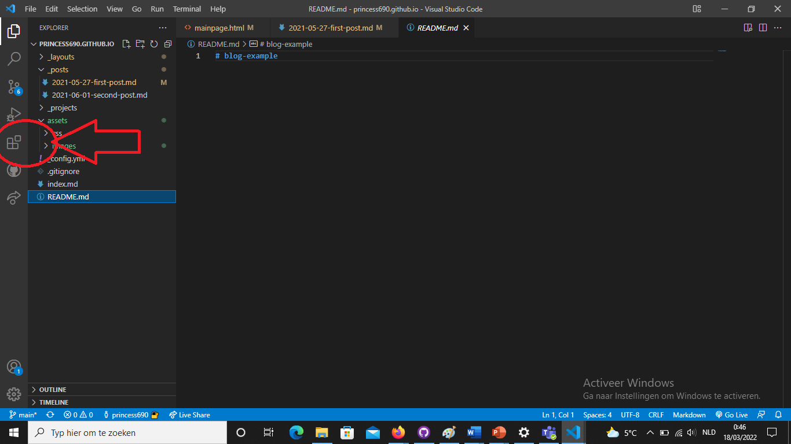
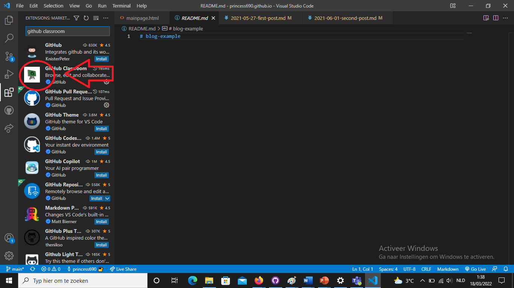
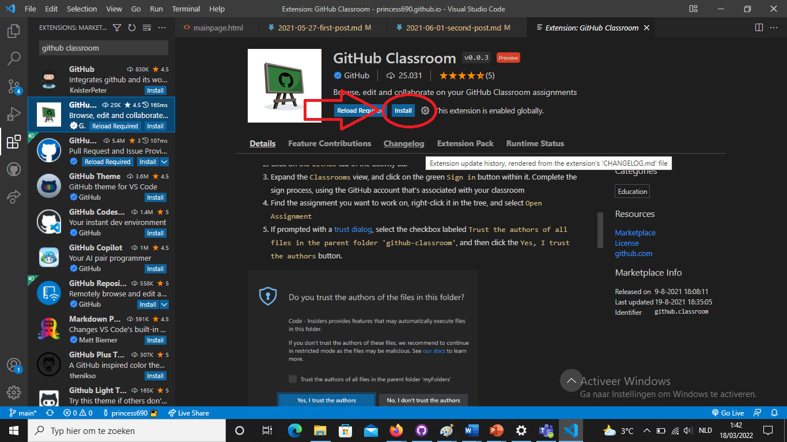
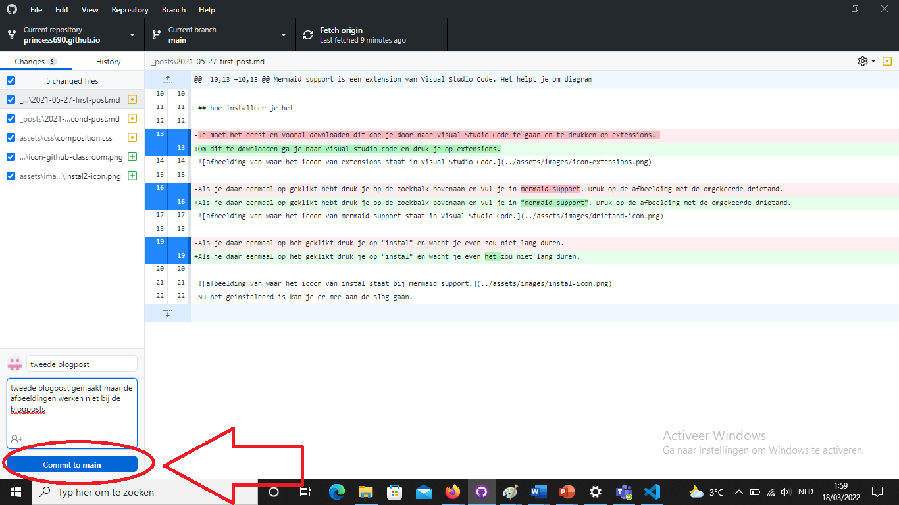
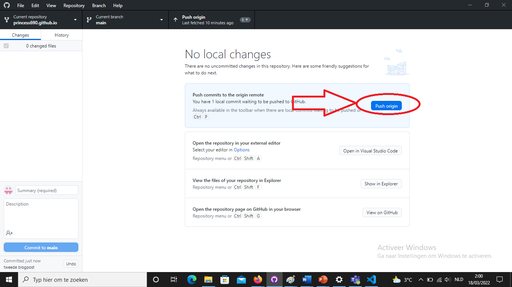

<!--wat ik nu eigenlijk heb gekozen als blogpost onderwerp-->
## uitleg

Github classroom is een eenvoudige manier om op github samen te werken voor educatieve redenen. de leraar maakt gewoon een groep aan en je kan beginnen. in de groep kan de leraar naar de studenten in de groep hun projecten kijken als die projecten behoren tot wat je in de groep kan zien. Zo kan je gemakkelijker kunnen werken met elkaar en samen een project maken zonder altijd je vooruitgang te laten zien.

<!--stap voor stap hoe je het installeer-->
## hoe installeer je het

Om dit te downloaden ga je naar visual studio code en druk je op extensions.

Als je daar eenmaal op geklikt hebt druk je op de zoekbalk bovenaan en vul je in "github classroom". Druk op de afbeelding met het school bord.

Als je daar eenmaal op heb geklikt druk je op "instal" en wacht je even het zou niet lang duren.

Nu het geinstaleerd is kan je er mee aan de slag gaan.

<!--hoe je mermaid support best zou gebruiken-->
## hoe gebruik je het

Je gebruikt het door te linken met je leraar als je dan met een vraag zit maar je kan het zelf niet oplossen dan kan je een mail sturen naar je leerkracht en hij kan dan zien wat er miss is of wat je anders zou kunnen doen. zonder een screenshot of scherm te moeten delen want hij kan er zelf aan. Dus het is eigenlijk een makkelijkere manier om een vraag te stellen als je het niet direct persoonlijk kan stellen. 

Als je github classroom correct wilt gebruiken moet je wel altijd in de juiste reposetory werken. want als je dat niet doet dan is het vaak zo dat de leraar je project niet ziet en als je het dan te laat merkt dan krijg je een 0 terwijl je ze wel had gemaakt. En vergeet vooral nooit te committen en te pushen.

