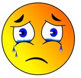

<!--waarom ik mijn eerste project heb gemaakt-->
## Oorzaak

Als kennis making spel liet meneer Van Battle ons een spel spelen genaamd "Superfight". We speelde twee rondes. Ik verloor elke keer met de rotste superheld. En dan kwam het nieuws, het slechtste nieuws ooit. Wij moesten een website maken over je superheld. En mijn superheld was een slang zonder handen en met een dolfijn als hulpje. ik probeerde mijn best maar het beste dat ik kon verzinnen als naam was "Snake" en voor de dolfijn "Flipper". Ik heb alles dat ik over html en css weet in deze periode geleerd.

<!--wat ik goed heb gedaan bij dit project-->
## Mijn goede punten

Mijn goede punten waren sowieso mijn creativiteit. Het is niet makkelijk om van zo een nutteloze held een website te maken.

Ook de manier hoe ik mijn strips en getuigenissen heb geordend vond ik goed. dit is het enigste project waar mijn css een beetje bij mee viel.

<!--wat ik minder goed heb gedaan bij dit project-->
## Mijn slechte punten

ik kan geen css. ik mijn best geprobeerd in deze opdracht en heb een lange tijd besteed aan mijn css maar het was nog steeds niet helemaal goed. En soms lijkt het alsof ik geen cursus heb voor informatica maar dat heb ik wel en dat vergeet ik bijna altijd.

<!--wat ik zou kunnen veranderen-->
## wat ik zou kunnen veranderen

Ik zou wat meer kleur kunnen gebruiken en wat ordelijker te werk gaan met mijn css want die is helemaal in de war.

<!--wat ik zelf vond van hoe ik werkte-->
## Oordeel

ik heb veel verbeter punten en moet hard werken maar als voort blijf doen en blijf oefenen kom ik er wel.

<!--wat ik eigenlijk vond van dit project-->
## Conclusie

Alnog had ik een flut superheld, was het een beetje raar en had ik veel te klagen was het toch een leuk project. En ik vond het spel oprecht leuk. In het algemeen was mijn project cava en ik vond dat goed. 